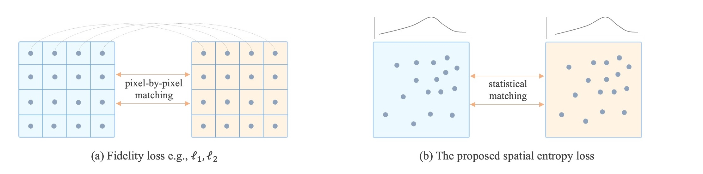
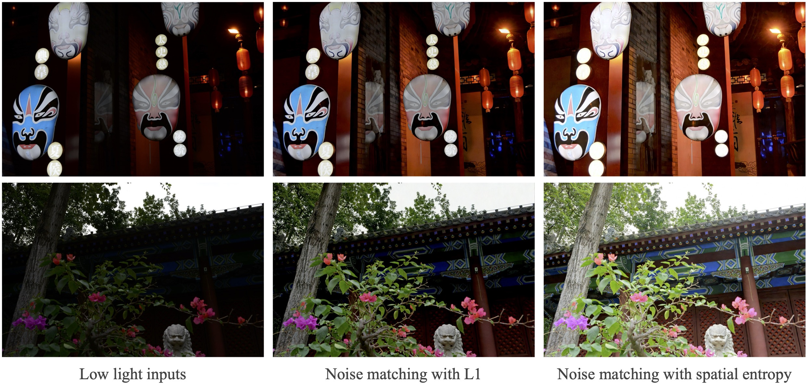

## Entropy-SDE | [Paper](https://arxiv.org/abs/2404.09735) <br><sub>Equipping Diffusion Models with Differentiable Spatial Entropy for Low-Light Image Enhancement, CVPRW 2024.</sub>


#### Image reconstruction based on statistical matching 


### Dependenices

* OS: Ubuntu 20.04
* nvidia :
	- cuda: 11.7
	- cudnn: 8.5.0
* python3
* pytorch >= 1.13.0
* Python packages: `pip install -r requirements.txt`

### Training
The current config setting is for low-light enhancement but you can change the dataset path to adapt it for other tasks.

Run the training code:

```
cd codes/config/low-light
python train.py -opt=options/train/entropy-refusion.yml
```

#### Differentiable Spatial Entropy
Key code for the differentiable spatial entropy is the [kde_utils.py](https://github.com/shermanlian/spatial-entropy-loss/codes/config/low-light/models/modules/kde_utils.py).

### Testing
Change the dataset and the pretrained model path in the option file.

```
cd codes/config/low-light
python test.py -opt=options/test/refusion.yml
```

**Examples on the NTIRE challenge:**


#### Pretrained models
We also provide the **pretrained models** for the [challenge](https://drive.google.com/file/d/1dtC1BW2o2WlGWmvvfg18KZVyudaCbtkh/view?usp=sharing), [LOLv1](https://drive.google.com/file/d/1Q3xPy8L7G7YajEl2iHuFmYHV9fxtxGMy/view?usp=sharing), and [LOLv2-real](https://drive.google.com/file/d/1UQ_CbDSqkc4i-Ho4_fbtOMPQhPmI41nk/view?usp=sharing).

#### Citations
If our code helps your research or work, please consider citing our paper.
The following are BibTeX references:

```
@article{lian2024equipping,
  title={Equipping Diffusion Models with Differentiable Spatial Entropy for Low-Light Image Enhancement},
  author={Lian, Wenyi and Lian, Wenjing and Luo, Ziwei},
  journal={arXiv preprint arXiv:2404.09735},
  year={2024}
}
```


#### Contact
Thanks for your interest! If you have questions please contect: shermanlian@163.com
